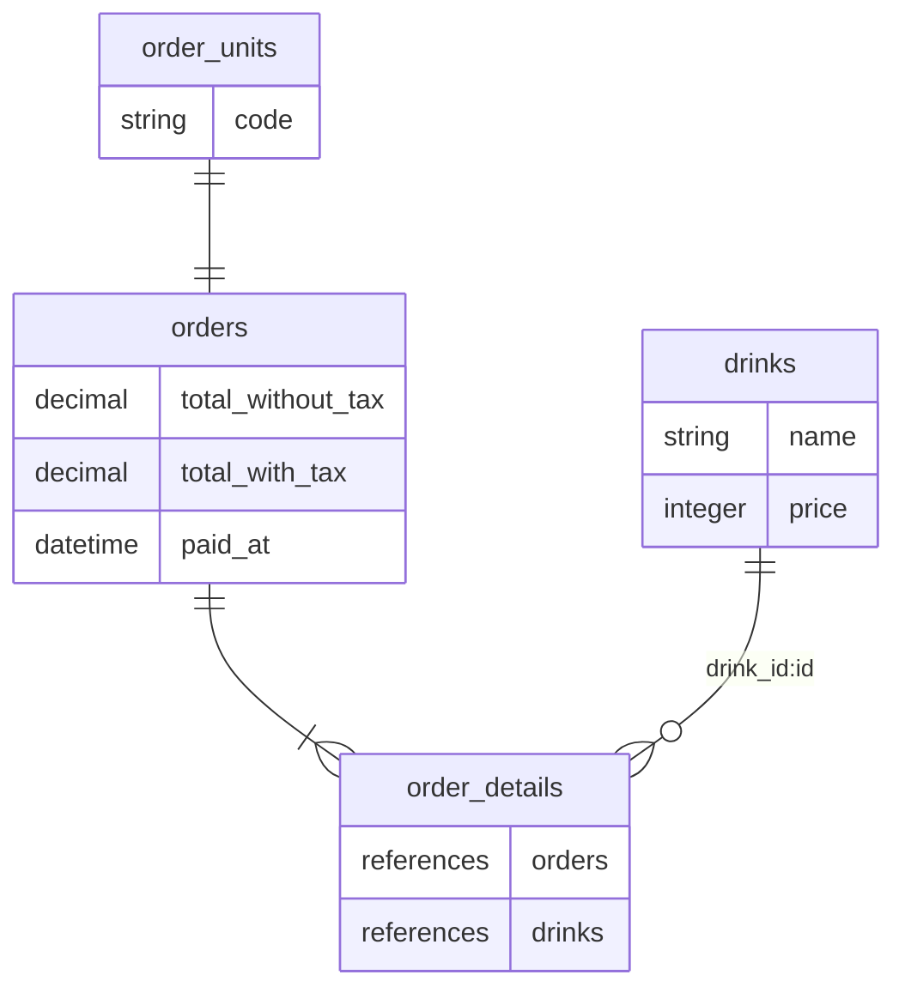

```mermaid
erDiagram
  order_units ||--|| orders : ""
  orders ||--|{ order_details: ""
  drinks ||--o{ order_details: "drink_id:id"

  order_units {
    string code
  }

  orders {
    decimal total_without_tax
    decimal total_with_tax
    datetime paid_at
  }

  order_details {
    references orders
    references drinks
  }

  drinks {
    string name
    integer price
  }
```

## er図に関して
* １つのdrinkに対して、複数のorder_detailが存在する
* そのため、1：0以上の関係
* order_detailsからすると1オーダーにつき1drinkのため`belongs_to :drink`になる
* ordersに商品を含めると一回の注文につき１つしか注文できない
* そのための中間テーブル